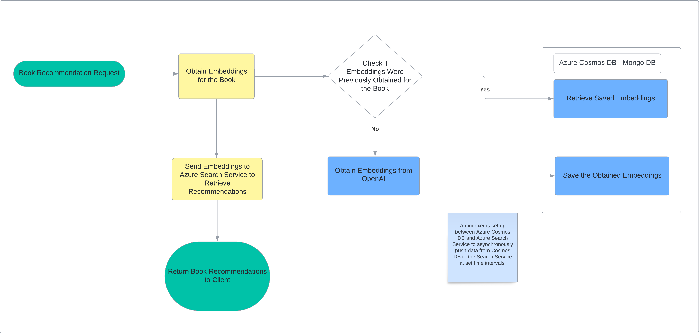

# Best Reads Extensions

This project serves as an extension to improve the final year group project I was a part of at the university.

## New Features Introduced

### Recommendations

- Implemented a new recommendations layer utilizing embeddings to identify similar items (books).
- An overview of the process is illustrated in the workflow diagram below.

[{: width="50%"}](https://github.com/Marvan-T/bestreads-extensions/assets/65969444/dd644f80-2b07-4452-baf3-350206d308ad)
