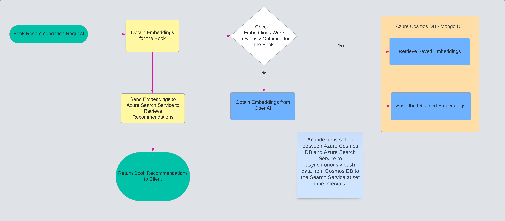

# Best Reads Extensions

This project serves as an extension to improve the final year group project I was a part of at the university.

- Original Group Project: [https://github.com/laurenmaylittle-cs/book-recommendations](https://github.com/laurenmaylittle-cs/book-recommendations)
- Fork that I currently maintain: [https://github.com/Marvan-T/book-recommendations](https://github.com/Marvan-T/book-recommendations)

The project is deployed on Azure and can be accessed using either of the URLs:

- [https://best-reads.azurewebsites.net/](https://best-reads.azurewebsites.net/)
- [https://best-reads-live/](https://best-reads.live/)

## New Features Introduced

### Recommendations

- Implemented a new recommendations layer utilizing embeddings to identify similar items (books).
- An overview of the process is illustrated in the workflow diagram below.

[{: width="50%"}](https://github.com/Marvan-T/bestreads-extensions/assets/65969444/dd644f80-2b07-4452-baf3-350206d308ad)
